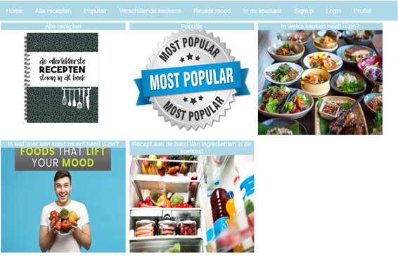

*** Inhoudsopgave ***
1. De werking van de applicatie
2. Het stappenplan voor de applicatie
3. De NPM commands die je eventueel nodig hebt

# 1. Hoe en wat is de werking van de applicatie/

De applicatie wordt gebruikt om op zoek te gaan naar de recepten
die de gebruiker wil weten. Er zijn heel veel combinaties en
mogelijkheden om de recepten op te zoeken. Dit staat vast op de home
pagina beschreven en is daar ook afgebeeld.

Daarnaast heb je verschillende keuzes om gerechten op te zoeken
zoals: Alle recepten die we hebben, de meest populaire gerechten die
we hebben, gerechten waar jij zin in hebt en we hebben een koelkast
waar jij de producten kan vinden die over zijn gebleven. 

De koelkast wordt gebruikt om de ingredienten op te zoeken om zo tot
een goed gerecht te komen met de ingredienten die jij nog hebt. Een
andere feature is die van het regristreren en het inloggen van een
gebruiker. De gebruiker kan en moet zich eerst regristreren voordat hij
of zij kan inloggen. Dit is een simpel proces dus bijna geen een 
gebruiker zou hier problemen mee hebben.

# 2. Hoe start je nou de applicatie?

1. We beginnen bij de API key. Hiervoor zijn een aantal stappen noodzakelijk.
   1. Maak in de root map (op dezelfde hoogte als de .gitignore en package.json) een .env én een .env.dist file aan.
   2. Open de .env.dist en zet daar REACT_APP_API_KEY=. De waarde laten we hier leeg. Het is conventie om environment variables in hoofdletters te schrijven.
   3. Kopieer de naam van deze variabele en plak het in .env. Plak de waarde van de API key er direct achter (geen spaties of quotes)
      1. De API key die wordt gebruikt is: 58d9ee76861142d19ae15d8da98f6abf
   4. Run het commando npm run build in de terminal.
2. Open je webbrowser en typ htpps://nodejs.org/en/ in of kopieer
   deze uit dit document en plak het in je webbrowser.
3. Als je op de site van nodejs bent aangekomen moet je nodejs natuurlijk.
   downloaden. Dit doe je door dubbel te klikken op de linker download button.
4. Als je dit proces hebt doorlopen kan je het project in webstorm openen.
5. Als het goed is kan je dan "npm start" in de console intypen die zich
   links onderin naast de slidebar plaatsvindt.
6. Als het goed is opent de webbrowser nu automatisch de website. Als
   dit niet het geval is kun je het ook handmatig intypen doormiddel
   van dit in te typen in je webbrowser. http://localhost:3000
7. De applicatie is nu up and running succes met het opzoeken van alle
   lekkere gerechten!

# 3. Eventuele commands die je nodig zal hebben

1.  npm install react-router-dom axios @splidejs/react-splide
2. 'npm start' Met dit command start je de applicatie waardoor
    je de site in je webbrowser kan opzoeken.
3. 'npm test' Met dit command test je de applicatie.
4. 'npm run build' met dit command ga je de applicatie bouwen / starten
    in productie.

# 4. Github pagina waar project staat
1. https://github.com/EwoudKoster123/EindEindOpdracht_FrontEnd_EwoudKoster_2023